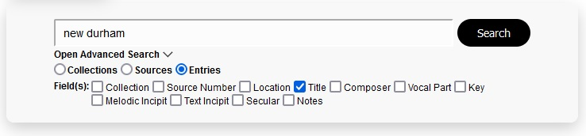
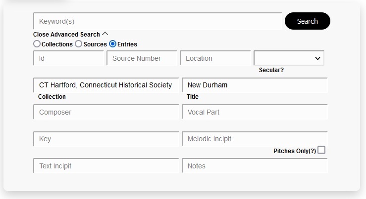
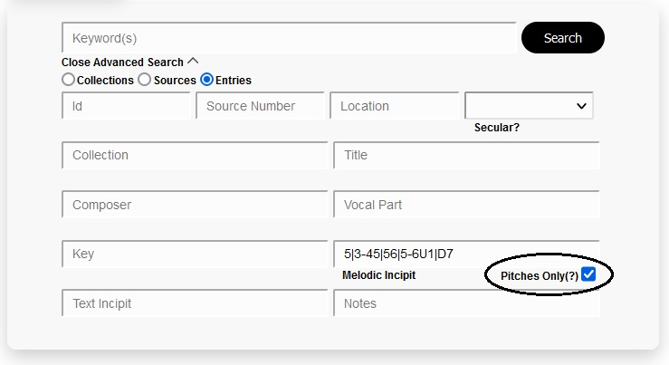
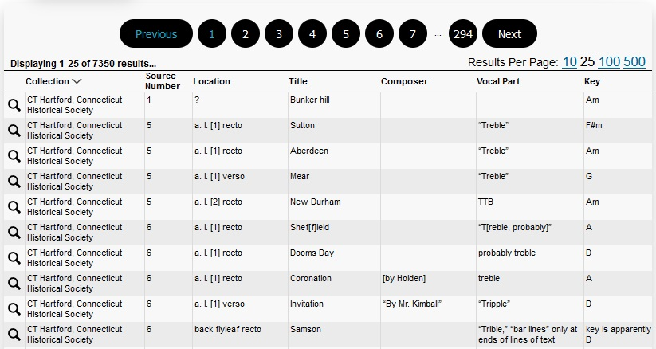
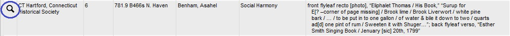
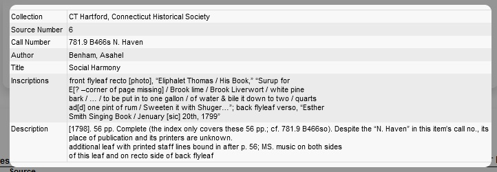
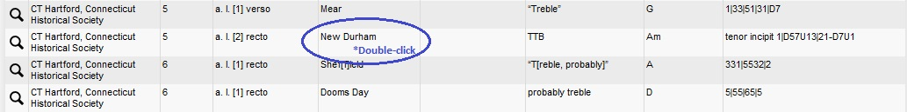
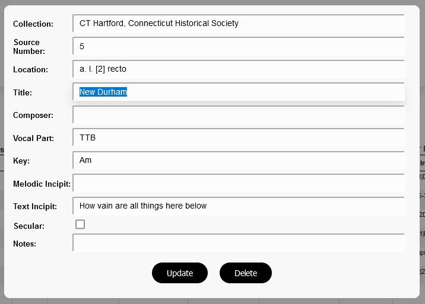
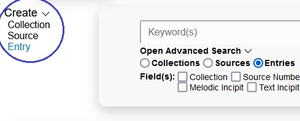
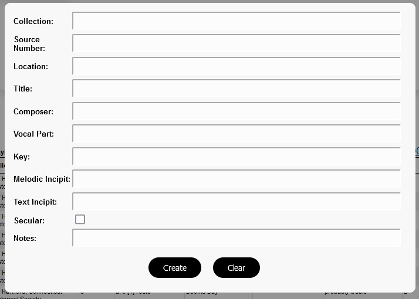

*This is a demo version of this application, meant to serve as a sample of my work.

# Music Inventory Web

A full-stack web application for searching, viewing, and editing the Sacred Music Inventory MySQL database.

Built using Spring Boot, React, Redux, Jest, MySQL, and SASS with a fully test-driven front end.

## Background

This application is the React version of the original [Music Inventory Web application](https://github.com/2human/music-inventory-web). Like the original, it is built around the MySQL database compiled with the [Music Inventory Parser application](https://github.com/2human/music-inventory-parser).

I had a various motivations for re-writing the front end of the original Music Inventory Web application. The original version felt like it needed to be re-created from scratch in order to bring it up to an adequate standard of quality. As my first web application, the underlying architecture was off. For example, all of the JavaScript code was contained within a small number of files (after originally being all in one file!). It was also my largest project completed project at the time, but it was not an example of the type of work I'd be doing in a professional environment, as most JavaScript projects are now built using frameworks, diminishing its value as a portfolio project. During the period before I started the remake, I was trying to find portfolio project I could create using React with a test-driven approach.

For these reasons and a few others, remaking the application made complete sense.

Doing the remake also had the added benefit of allowing me to see the contrast between a plain JavaScript application and one written in React, which showed the value of using a framework instead. Not having to completely redo everything, such as the planning/web design, made it so I could focus on other areas, such as testing, modularity, organization, scalability, and maintainability. I consider focusing on and learning about these broader development principles, especially testing, to be one of the most fruitful learning experiences I've had as a developer.

## Overview

The Sacred Music Inventory database contains three tables: collections, sources, and entries.

The primary function of the application is searching the Sacred Music Inventory database. It is capable of performing both basic and advanced searches.

The secondary function is editing the database, mostly for use by the author of the source Word documents, who is responsible for maintaining the content within the database. This includes a UI with corresponding API's for creating, updating, and deleting database entries.

## Basic Search

Below is an example of the basic search feature in use.

The user types the search term into the keyword field, and each field is checked for the presence of the string.

The server achieves this by performing a SQL query of each selected field against the search term, utilizing a Set object in order to avoid duplicates.

In cases where no fields are selected, SQL queries are performed for every field in the same manner.

## Advanced Search

The user may perform an advanced search by clicking 'Open Advanced Search', which will replace the field checkboxes with a group of text inputs corresponding to each field.

Below is an example of the advanced search feature in use.

The user types their search text into the desired fields, and the server returns only database entries which contain the given text in their respective fields. The text is not case sensitive. In the example above, entries containing both "CT Hartford, Connecticut Historical Society" in the 'collection' field and "New Durham" in the 'title' field. The keyword search may still be used, and performs similarly to as in a basic search, checking for the given term in every field.

The server achieves this by initially performing a SQL query of the first field containing text. It then filters the result set by checking for the existence the search text in each remaining advanced search field which contains text. In the example above, the server would first query the database for entries which contain the term "CT Hartford, Connecticut Historical Society" in the 'collection' field. It would then filter that result set according to each remaining field, in this case "New Durham" in the 'title' field.

To be clear, after the initial SQL query, the results are filtered on the server with no further SQL queries. Instead, it iterates over the result set, filtering out the results that do not contain the search text, returning a new data object containing the filtered results.

**Pitches Only**

One feature unique to advanced searches is the 'Pitches only' search, which may be performed within the 'melodic incipit' field of the Entries table. Pitches in this context are represented by numbers that correspond to musical pitches.

The text populating the 'melodic incipit field' is an example of what a melodic incipit looks like. When a 'pitches only' search is performed, all non-integer characters are filtered out of the search term, as well as the data being searched, when they are being evaluated against each other. More specifically, the search term in the example, "5|3-45|56|5-6U1|D7", would filtered down to "5345565617". Each melodic incipit would be filtered of all non-integer characters in the same fashion, and then compared against the melodic incipit containing only pitches. This feature makes melodic incipit searches much more viable, as the non-integer characters contained within the music inventories are inconsistent across different musical sources.

## Search Results

When a search is performed, the entire result set is transferred to the user at once rather than only the result page being viewed. The allows the user to instantaneously view the other pages in the result set without making additional server requests, which also reduces the amount of computation required by the server. The drawback is the increased amount of bandwidth that must be used to transfer the resources. As of now, the most results a user can acquire at once is about 7000 entries, which would occur if they performed a search that returned every row in the entry table. This amounts to 2.3 MB worth of data, which appears to be a worthy tradeoff. This may change as the application acquires more users, or as more data is added.

As shown in the example, the user may choose the results per page they would like to use, as well as the page number.

Additionally, the user may also open modals from the search results section that allow them to either view or edit the result set.

## Viewing Individual Search Results

The user may view a single search result by clicking on the magnifying glass in the first column.

This opens a modal with an expanded view of the search result, as shown below.

## Editing / Deleting Search Results

The user may edit a search result be double-clicking on any table cell.

This opens the editor modal, highlighting the field that was double-clicked, as shown below:

The user can then click 'Update' when they have made their desired changes.

The user may also click 'Delete' in order to delete the selected row.

## Creating Rows

Rows can be created by hovering 'Create', and then clicking the datatype of the row they would like to create.

This opens the modal for creating rows, as shown below:

The user can then fill out the fields, and click 'Create' in order to create a new row.

## Web Design

The web design for this project was performed using SASS with BEM and 7-1 architecture.

## Testing

A fully test-driven approach was used when putting together this application with the Jest library. Every layer of this application is tested. This includes the components, helper functions, and the Redux store (actions, reducers, sagas).
